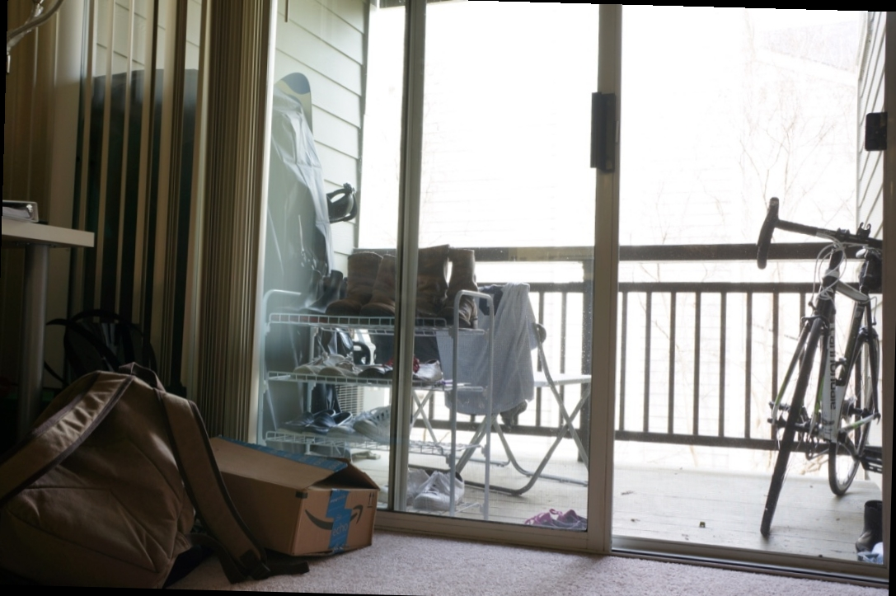

# DIP-HDR
Implementation of HDR Image Project was carried out for the course of Digitial Image Processing in Aristotle University of Thessaloniki\
(Dept. of Electrical and Computer Engineering) based on the paper "Recovering high dynamic range radiance maps from photographs",\
by Paul E. Debevec and Jitendra Malik, written in 2008, which can be found [here][paper]

The purpose of this project is to construct an HDR mapping of a set of images of the same scene, under different exposures.\
The project is split up in 4 demos, according to the requirements of the task outline, as in Task_Outline.pdf (greek version only)\
More details about each part can be found below.

# Some insight on HDR Imaging
<sub><sup>*(This part serves as an illustration of the main idea/gist behind this project, for more details please refer to the paper by Debevec et al.)*</sup></sub>\
\
In order to achieve a numerical approximation of the [irradiance][irr] $E$ of a scene depicted by a set of digital images, taken with different exposure times
and based on the [paper][paper] of Debevec et al., it is assumed that: 
$$g(Z_{i,j}^k) = \ln{E_{i,j}} + \ln{\Delta t_k}$$
where: $Z_{i,j}^k \in [Z_{min},Z_{max}]$ is the value of the pixel $(i,j)$ of the $k$-th image,\
$E_{i,j}$, is the irradiance for this pixel (assumed constant over the multiple shots of the scene),\
$\Delta t_k$, is the exposure time for the $k$-th shot\
and $f=e^{g}$, is a nonlinear function, assumed to be smooth and monotonic.\
\
Let $K$ be the total number of different exposures/images, and ($M,N$) be the size of each of them. Then a Least-Squares Estimation for the two sets of uknowns - the $M \cdot N$ values of $E_{i,j}$ and the ($Z_{max} - Z{min} + 1$) values of $g(Z)$ - can be obtained by minimizing the following quadratic objective function:
```math
$$O = \sum_{i=1}^{M}\sum_{j=1}^{N}\sum_{k=1}^{K} \{ w(Z_{i,j}^k) [g(Z_{i,j}^k) - \ln{E_{i,j}} - \ln{\Delta t_k}]\}^2 + \lambda \sum_{z=Z_{min}}^{Z_{max}} [w(z)g^{''}(z)]^2$$
```
where $w(Z_{i,j}^k)$ is a weighting function applying more weight to the middle values of $Z$ and less close to each end,\
$\lambda$ is a smoothness factor\
and $g^{''}(z) = g(z-1) - 2g(z) + g(z+1)$ is an approximation of the second derivative of $g(z)$.\
\
This objective function describes an overdetermined system (under some conditions) which can easily be solved using the Singular Value Decomposition method, producing the HDR mapping.
# Weighting functions
Multiple weighting functions are used as required in the task outline, namely:
+ Uniform
+ Tent
+ Gaussian
+ Photon\
\
More info about the definition of each function can be found in the outline
# Demo files

+ Demo1: A folder containing a set of LDR is supplied (interactively), the images are rescaled to the range $[0, 1]$, the response function $f$ is assumed to be the identity function having saturation values of $Z_{min} = 0.05$, $Z_{max} = 0.99$, and the radiance mapping is done seperately for each channel and each weighting function. The histograms of each radiance map are also produced.
+ Demo2: Extension/Continuation of Demo1; basically tone mapping is applied to the output image from Demo1 and the corresponding image is displayed.
+ Demo3: HDR mapping is constructed for the two sets of images supplied (they are resized to make the estimation computationally feasible). No assumption is made for the response function $f$, instead it is estimated as illustrated above.
+ Demo4: Image2 set of images contains an image where the scene is not aligned with the rest of the images, therefore applying the HDR procedure alone produces some ghosting. In this demo image registration is applied before HDR mapping, producing a significantly better quality final image.

# Demonstration of final results
Image2-00 | Image2-01 | Image2-02 | Image2-03 
:-------------------------:|:-------------------------:|:-------------------------:|:-------------------------:
 |  |  |  
Image2-04 | Image2-05 | Image2-06 | Final output (after registration)
 |  |  | 

# Disclaimer
A script from the paper by Debevec et al. is used to solve the minimization problem via the SVD method. Minor tweaks have been made to the script.

[paper]: <https://doi.org/10.1145/1401132.1401174> "Recovering high dynamic range radiance maps from photographs, by Debevec et al., 2008"
[irr]: <https://en.wikipedia.org/wiki/Irradiance> "Wikipedia: Irradiance"
